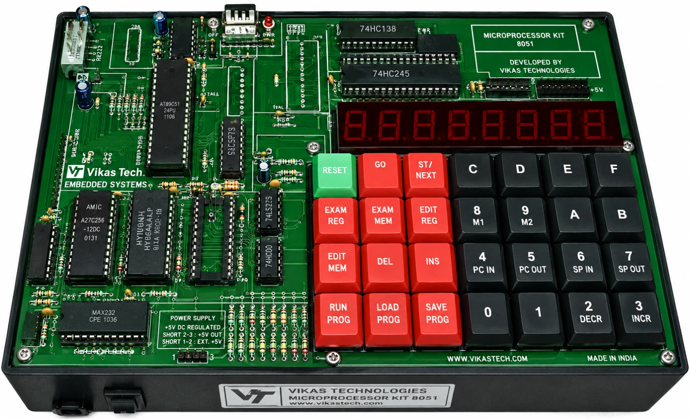
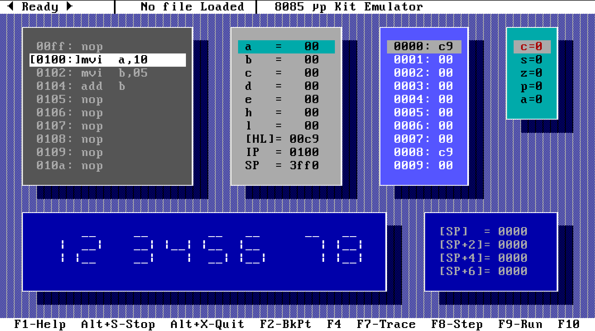

# Intel 8085 Microprocessor Simulator: LinkedIn Post

_Intel 8085 Laboratory Hardware Kit_

> **From Borland C++ (DOS) to React & AI: Rebuilding a 30-Year-Old Simulator 🚀**
>
> In 1995, I sat in front of a DOS monitor and compiled the first version of an Intel 8085 microprocessor simulator using **Borland C++**.
>
> Back then, university labs had a real bottleneck: physical 8085 trainer kits (like the one pictured) were expensive, fragile, and frequently broken. Whole groups of students had to crowd around a single working board, and many never got enough hands-on time to actually learn.
>
> The DOS simulator fixed that — it gave every student their own virtual hardware to write assembly, step through registers, and watch system state change in real time.
>
> It was later published alongside the fifth edition of Ramesh Gaonkar's textbook "Microprocessor Architecture, Programming, and Applications with the 8085." It was also used in various universities, and I got lots of fan mail.

_The DOS based simulator, written in Borland C++_

> The simulator included a **2 pass assembler, debugger, views for memory, registers, flags, stack and the ability to modify them in real time**. The simulator also supported the LED panel, I/O ports.
>

## 30 Years Later
>
> Thirty years later, I gave it a fresh life for the modern web — React, Vite, WebAssembly, CodeMirror 6 — this time built in collaboration with an Agentic AI coding assistant (Claude and Gemini). The AI didn't just generate boilerplate; it acted as a systems engineer, designing architecture and solving real engineering problems using my DOS based simulator source code as the starting point. I was able to get a very workable UI in just a few days, but my progress was hampered by token limits — so I upgraded my Claude and Gemini subscriptions. It was worth it.

>
> ⚡ **Background Web Worker emulation**: Running the simulator at "Warp Speed" (millions of instructions/sec) used to freeze the browser's UI thread completely. The AI built a Web Worker architecture with message-passing (`startWarp`, `stop`, `assertInterrupt`) and throttled state updates, so the UI stays fully responsive even at full speed.
> ✏️ **Real-time on-the-fly linting**: Standard linters compile as you type, which would've corrupted the simulator's live register/memory state. The AI built a side-effect-free "dry-run" compiler and wired it into CodeMirror 6, so syntax errors show up as wavy underlines instantly — with zero impact on the running simulation.
> 🔬 **Strict register validation**: The legacy assembler was too permissive, silently mis-compiling invalid code like `PUSH BC` or `MOV SP, A`. The AI rewrote the parser to strictly validate register widths and operand pairs, matching the real limits of 8085 silicon.
> 🧪 **Zero-regression test coverage**: The AI expanded the test suite to 395 automated tests, run via WSL, keeping every legacy instruction and new validation rule passing at 100%.
> 🎨 **Retro Themes**: AI helped me create retro themes like "Green CRT", "Gray Retro", and "Turbo C" — even recreating classic CRT artifacts like flicker, static, V-Sync, H-Sync, and chroma aberration.
> 🎯 **Microprocessor Iconography**: The AI helped design a custom horizontal 40-pin DIP microprocessor SVG icon and pixel-art favicons (16x16 and 32x32) that model the physical layout of the real 8085 silicon chip.

## Caution: AI Makes Tall Claims!
> Building software with AI isn't just code generation anymore — it's having an autonomous partner that proposes architectures, manages multi-threaded state, and writes its own tests along the way, but it was not all perfect. The AI made plenty of mistakes and assured me that "everything was all right," but manual testing revealed otherwise. My main job was to test things in ways the AI tool wouldn't have thought of, then feed those results back to it to improve the code and tests.
>
## An Unexpected Outcome
> My 10-year-old (at the time of writing this article) was watching me use AI to do all the coding, and it inspired him to contribute the "chaos" mode effect for the retro themes. He stumbled through prompting but was able to figure out how to do it in a very short period of time.

## The Takeaway
> Software engineering is changing. My role shifted from writing syntax to directing architecture, designing test cases, and debugging edge cases. The AI is a powerful accelerator, but human oversight and hands-on testing are still the ultimate gatekeepers of quality.

## The Outcome
> Seeing code I first compiled in DOS with Borland C++ now running at warp speed in a browser, fully modernized with AI, is incredibly fulfilling. Here's to the next generation of students learning microprocessor architecture. 🛠️

>
>
> #Intel8085 #SoftwareEngineering #Microprocessors #AI #AgenticAI #Coding #EdTech #WebAssembly #ReactJS #Vite #BorlandCpp #DOS
